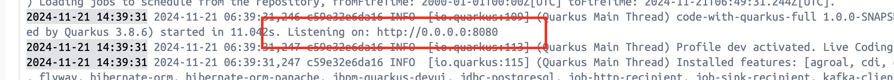
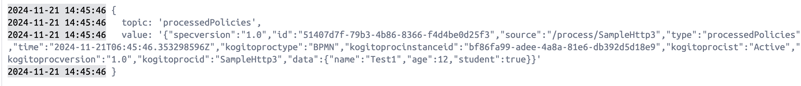

# BAMOE-SampleHttp
This is a sample project to demonstrate how to use the BAMOE framework to create a simple HTTP endpoint and communicate outside via kafka.

## How to use:
1. Clone the repository.
2. Download the BAMOE maven repository that we provided via email and place it on the root of this directory named `bamoe-maven-repo-91a`.
3. Run `docker compose up -d`
    - Wait for a bit for the maven_builder to finish
    - 
    - If you see this, it means that the `maven_builder` is ready.
4. Access the Quarkus Dev-UI [here](http://localhost:8080/q/dev-ui/org.jbpm.jbpm-quarkus-devui/process-instances):

## Run Kafka Consumer
Since the `maven_builder` container state is already running, but the actual server is still building, the topic is not created yet. 

We need to restart the `ns-kafka-cnsmr` after the `maven_builder` is ready.

When using the `/SampleHttp3` endpoint with the sample request body, you should see the following logs:


## API
### Root URL:
```
http://localhost:8080
```

### Sample Body Request
```json
{
    "user": {
        "age": 12,
        "isStudent": true,
        "name": "Test1"
    }
}
```

### BPMNs
BPMN files are located in the `SampleHttp/src/main/resources` directory.

### Endpoints
- /SampleHttp1 `[HttpStartEventProcess1.bpmn]`
    - Simple http endpoint that has no error handler.
- /SampleHttp2 `[HttpStartEventProcess2.bpmn]`
    - Simple http endpoint that has error handler.
- /SampleHttp3 `[HttpStartEventProcess3.bpmn]`
    - Same with /SampleHttp2 but with kafka producer.